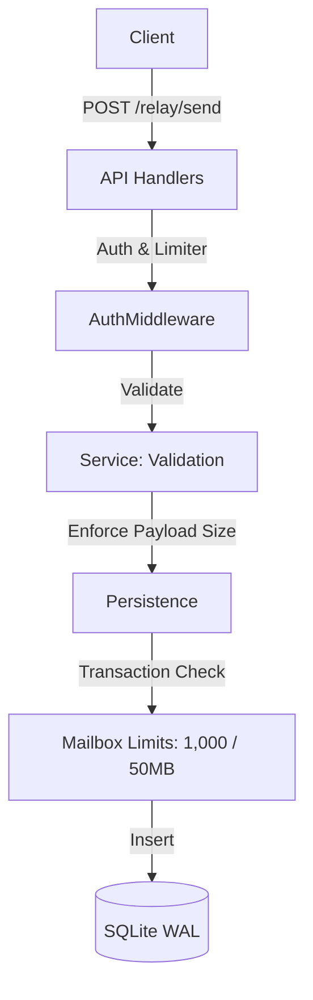

# Architecture Overview

NeoNect Server strictly segregates external HTTP components from persistence bounds.

## Subsystems

- **API Layer** (`internal/api/`): HTTP request translation, CORS bindings, global Rate Limiter (Token Buckets & Garbage swept TimeWindows), and `MaxBytesReader` enforcement mapping strictly against structural limits.
- **Service Layer** (`internal/service/`): Business logic boundaries verifying Device Ownership (`ValidateActiveDeviceOwnership`) natively before forwarding messages towards relay persistence.
- **WebSocket Manager** (`internal/service/websocket_manager.go`): Realtime boundary isolating connections via `connSem` limits preventing concurrent goroutine inflation attacks. Handshake validation restricts Origin checks explicitly over strict domain sets without arbitrary wildcard reflections.
- **Persistence Layer** (`internal/infrastructure/persistence/`): `modernc.org/sqlite` abstractions wrapping all Data Definition constraints exclusively into singular transaction models (`BeginTx` & `defer Rollback`) preventing database fragmentation natively.
- **Vault Engine** (`security/`): Master AES-256 GCM boundary isolating sensitive at-rest storage mechanisms independently.

## Data Flow Diagram (Messaging)

